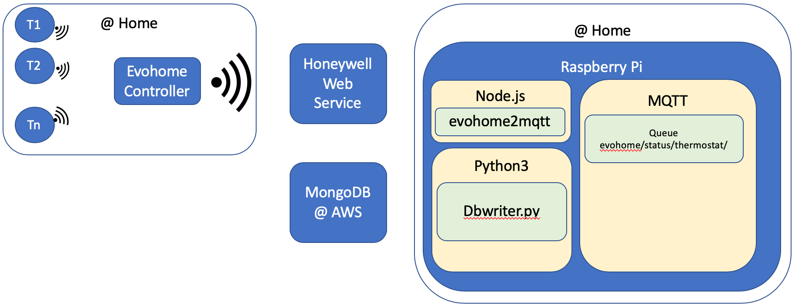

# Architecture

# Components

## evohome2mqtt

1. Start the Evohome reader to MQTT writer process in a separate shell via command

   `evohome2mqtt --user engelendom@gmail.com --password gertpwHoney1 -l debug`

## EvohomeReader

### Tasks it has to perform

1. Subscribe to MQTT evohome/status/thermostat queues - one queue per zone
   1. All topics underneath evohome/status/thermostat/# are subscribed to
   2. Read JSONs from all these queues
2. Parse JSON to retrieve the temp value and settings
3. Create a new JSON with only the fields wanted
4. Store the new JSON in MongoDB

### Data Structures Used

#### Data format of JSON received from MQTT

The following structure is received from a queue for a specific zone

`{
  "val": 21.44,
  "state": {
    "units": "Celsius",
    "indoorTemperature": 21.44,
    "outdoorTemperature": 128,
    "outdoorTemperatureAvailable": false,
    "outdoorHumidity": 128,
    "outdootHumidityAvailable": false,
    "indoorHumidity": 128,
    "indoorTemperatureStatus": "Measured",
    "indoorHumidityStatus": "NotAvailable",
    "outdoorTemperatureStatus": "NotAvailable",
    "outdoorHumidityStatus": "NotAvailable",
    "isCommercial": false,
    "allowedModes": [
      "Heat",
      "Off"
    ],
    "deadband": 0,
    "minHeatSetpoint": 5,
    "maxHeatSetpoint": 35,
    "minCoolSetpoint": 50,
    "maxCoolSetpoint": 90,
    "changeableValues": {
      "mode": "Off",
      "heatSetpoint": {
        "value": 20.5,
        "status": "Temporary",
        "nextTime": "2020-07-09T13:00:00"
      },
      "vacationHoldDays": 0
    },
    "scheduleCapable": false,
    "vacationHoldChangeable": false,
    "vacationHoldCancelable": false,
    "scheduleHeatSp": 0,
    "scheduleCoolSp": 0
  },
  "lc": 1594288958583
}`

* Field `val` contains Current Temp
* Field `lc` contains "Last Changed" timestamp. Consist of Unix Time + millisecs
* Field `state.changeableValues.heatSetpoint.value` contains Requested Temp
* Field `state.changeableValues.heatSetpoint.value.status` contains "Scheduled", Temporary" or "Hold":
  * Scheduled - Controlled by central program;
  * Temporary - requested Temp is until a specified time;
  * Permanent - Set to fixed temperature
* Field `state.changeableValues.heatSetpoint.value.nexttime` is present when requested temperature is temporary and then contains the datetime (in local time) till when it is valid (in yyyy-mm-ddThh:mm format)

## Data Format of JSON to be stored in DB

{
  "zone": "gert",
  "reading": {
    "timestamp": "2020-07-09T11:48:10",
    "currentTemp": 21.44,
    "setTemp": 22.5,
    "until": "2020-07-09T13:00:00",
    "status": "Temporary"
  }
}

